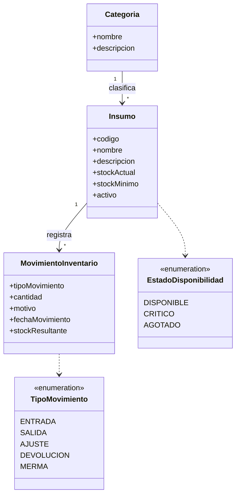

# Domain Model V1 - Inventory Supplies

## Objetivo

Representar las principales entidades identificadas durante la fase inicial de análisis del módulo de inventario de insumos.

## Entidades Identificadas

### Categoria

Responsabilidad:
Clasificar insumos para facilitar su organización y búsqueda.

### Insumo

Responsabilidad:
Representar un material gestionado por la empresa.

### MovimientoInventario

Responsabilidad:
Registrar cambios de stock generados por entradas, salidas o ajustes.

## Diagrama

## Observaciones

- Modelo preliminar sujeto a validación con el contador.
- Las categorías podrían convertirse en catálogo administrable.
- Los movimientos actualmente consideran entradas y salidas.
- Ajustes, mermas y devoluciones requieren validación.

## Próximos pasos

- Validar hipótesis de negocio.
- Confirmar tipos de movimiento.
- Diseñar agregados del dominio.
- Diseñar esquema de base de datos.
